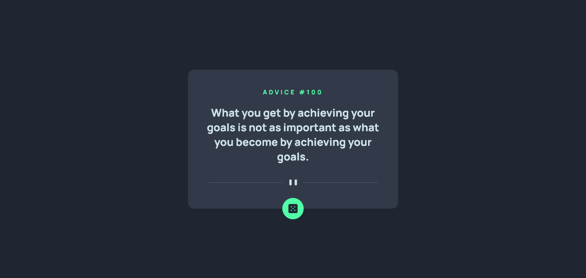

# Advice generator app solution

This is a solution to the [Advice generator app challenge on Frontend Mentor](https://www.frontendmentor.io/challenges/advice-generator-app-QdUG-13db).

## Table of contents

- [Overview](#overview)
  - [The challenge](#the-challenge)
  - [Screenshot](#screenshot)
  - [Links](#links)
- [My process](#my-process)
  - [Built with](#built-with)
  - [Useful resources](#useful-resources)
- [Author](#author)

## Overview

### The challenge

Users should be able to:

- View the optimal layout for the app depending on their device's screen size
- See hover states for all interactive elements on the page
- Generate a new piece of advice by clicking the dice icon

### Screenshot

### Links

- You can take a look [here](https://darrowv.github.io/advice-generator-app)

## My process

### Built with

- JavaScript
- Fetch API
- Sass/Scss
- Semantic HTML5 markup
- Flexbox
- CSS Grid
- Media queries

### Useful resources

- [Positioning in css](https://www.w3schools.com/css/css_positioning.asp)
- [Fetch API](https://developer.mozilla.org/en-US/docs/Web/API/Fetch_API/Using_Fetch)
- [API with random quotes etc.](https://github.com/lukePeavey/quotable)

## Author

- Github - [@darrowv](https://github.com/darrowv)
- Frontend Mentor - [@darrowv](https://www.frontendmentor.io/profile/darrowv)
- LinkedIn - [Nasyr Akhmadov](https://linkedin.com/in/darrowv)
- Telegram - [Muhammad Nasyr](https://t.me/m_nasyr)